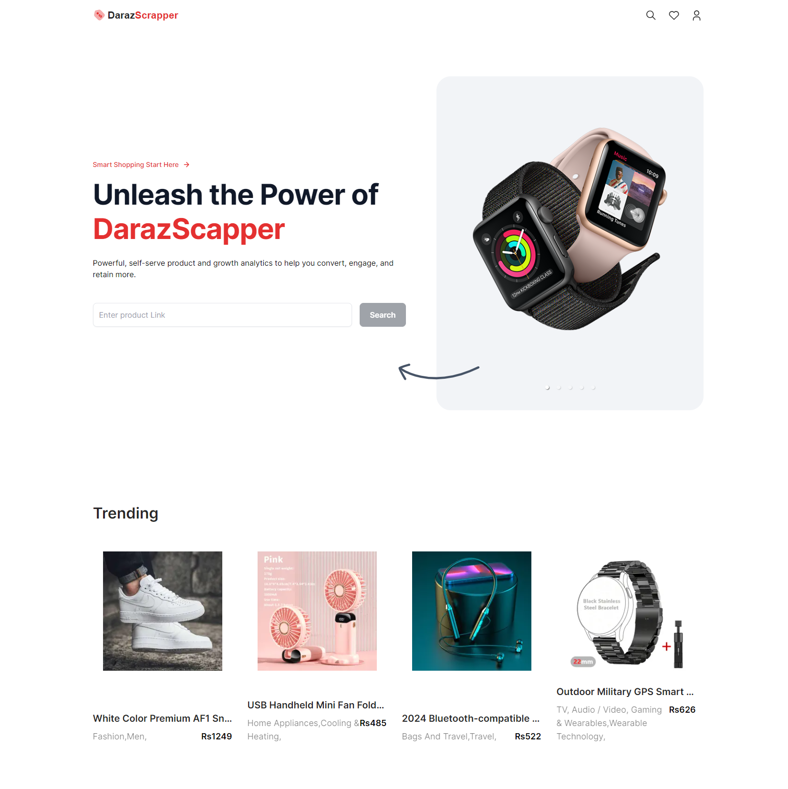
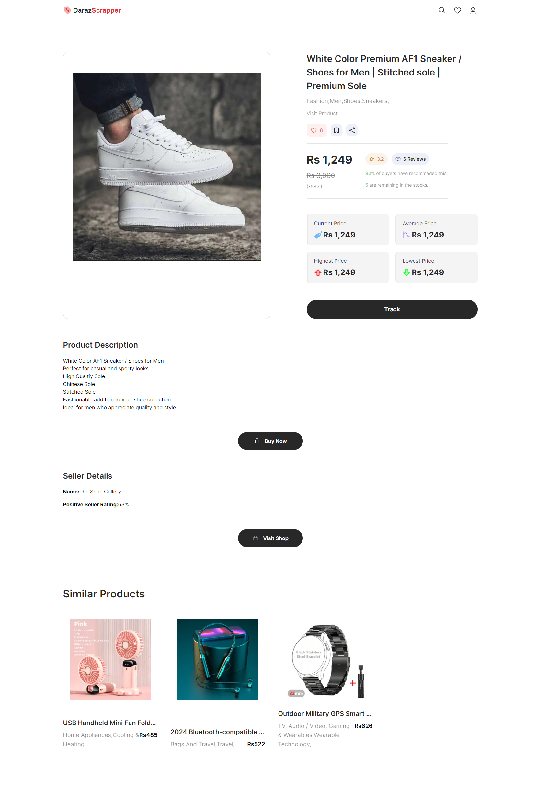
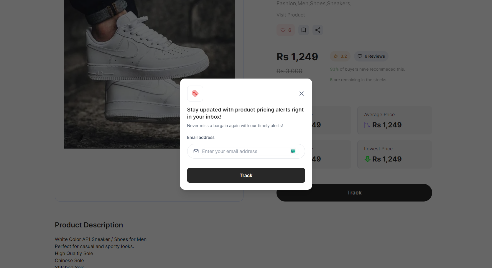

# DarazScrapper

A Next.js application to scrape product details from the popular e-commerce site Daraz, track price changes, and notify users when specific conditions are met.

## Table of Contents

- [Description](#description)
- [Features](#features)
- [Technologies Used](#technologies-used)
- [Prerequisites](#prerequisites)
- [Installation](#installation)
- [Usage](#usage)
- [Website](#website)
- [Contributing](#contributing)
- [Authors and Acknowledgments](#authors-and-acknowledgments)
- [License](#license)

## Description

DarazScrapper is a web application built with Next.js that scrapes product details from Daraz, records the highest and lowest prices, and provides a notification system for price changes. It uses MongoDB for data storage and Bright Data for efficient scraping.

## Features

- **Price Tracking**: Records highest and lowest prices for products over time.
- **Notification System**: Sends alerts when price drops below a set threshold.
- **Web Scraping**: Extracts product details like name, price, and rating.
- **Cron Jobs**: Schedules scraping tasks to run periodically.

## Technologies Used

- **Next.js**: React framework for server-side rendering.
- **MongoDB**: NoSQL database for storing scraped data.
- **Bright Data**: Data collection and web scraping tool.
- **Node.js**: Server-side environment.
- **Tailwind CSS**: Utility-first CSS framework.

## Prerequisites

Before installing, make sure you have the following:

- Node.js v14 or higher
- npm or Yarn
- MongoDB instance

## Installation

1. Clone the repository:

   ```bash
   git clone https://github.com/Eemayas/Daraz_Scraper.git
   cd Daraz_Scraper
   ```

2. Install dependencies:

   ```bash
   npm install
   # or
   yarn install
   ```

3. Set up environment variables:
   Create a `.env.local` file with the following variables:

   ```env
    MONGODB_URI=<your-mongodb-uri>
    BRIGHT_DATA_API_KEY=<your-bright-data-api-key>
    BRIGHT_DATA_USERNAME=<bright-data-username>
    BRIGHT_DATA_PASSWORD=<bright-data-password>
    EMAIL_USER=<email-address>
    EMAIL_PASSWORD=<email-password>
   ```

4. Start the development server:
   ```bash
   npm run dev
   # or
   yarn dev
   ```

## Usage

1. Add the URL of the product you want to scrape:

   ```js
   const productUrl = "https://www.daraz.com.np/products/example-product";
   addProductToScraper(productUrl);
   ```

2. The app will automatically track the price and notify you of any significant changes.

## Website

You can view the live demo of DarazScrapper at [https://daraz-scraper.vercel.app/](https://daraz-scraper.vercel.app/).

## Demo

### Home Page



### Product Page



### Tracking Product



## Contributing

Contributions are welcome! Please fork the repository and submit a pull request.

## Authors and Acknowledgments

- **Prashant Manandhar** - [Eemayas](https://github.com/Eemayas)
  - Email: prashantmanandhar2002@gmail.com
  - Website: [https://www.manandharprashant.com.np/](https://www.manandharprashant.com.np/)

## License

This project is licensed under the MIT License.

---
